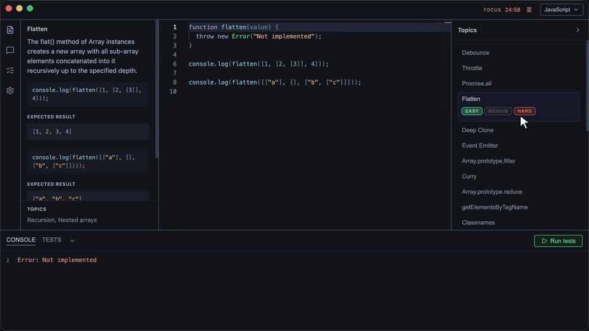

# Practice Pad

**A focused macOS scratchpad for practising the JavaScript and TypeScript questions
that keep coming up in front-end interviews.**

  

## What it is

Twenty-four classic interview problems, each with a written brief, worked examples and a
hidden test suite. Pick a question, write the solution in a real editor, run the tests, and
ask Claude when you get stuck.

No browser tabs, no sign-in, no scoreboard. Your work is saved on your Mac and stays there.

## Features

### A real editor, in JavaScript or TypeScript

Monaco, the editor from VS Code, with full language services: completion, hover types,
inline diagnostics and go-to-definition. Switch a question between JavaScript and TypeScript
at any time and the starter code, examples and tests all switch with it. TypeScript starters
come with the interfaces already written, so you implement against a real signature.

### A built-in test runner

Every question ships with a hidden suite. Hit **Run tests** and the results appear in the
panel below the editor, alongside a console for your own `console.log` calls. Your code runs
in a separate sandboxed process, so an infinite loop costs you a click rather than the app.

### Three difficulty levels that build on each other

Easy, Medium and Hard are not three different questions. They are the same question with
more asked of you, and each level includes everything below it.

`debounce` at Easy just has to delay the call. At Medium it also needs `cancel`. At Hard it
needs `flush` as well. The brief, the examples and the hidden tests all move together, so
what you are shown always matches what you are marked on.

### An AI assistant powered by Claude

Stuck on a question, or want your working solution critiqued? The AI panel reviews the code
you have actually written against the brief you are actually on. It runs on your own
Anthropic API key, and code is only ever sent when you press send.

### Progress tracking

A dedicated tab showing which questions you have passed, at which level, and in which
language, so you can see the gaps rather than guess at them.

### A Pomodoro timer

Built into the toolbar, because the point is to practise for twenty-five minutes, not to
open the app and reorganise your folders.

### Small things that matter

- **Autosave.** Your work in progress survives a quit, per question and per language.
- **Auto-run.** Tests can re-run as you type, so the feedback loop stays tight.
- **Your key, your keychain.** The Anthropic key is stored in the macOS keychain, never in a
  config file.
- **Automatic updates.** New releases install themselves.

## The questions

<table>
<tr><th align="left">Foundations</th><th align="left">Data and objects</th><th align="left">Advanced</th></tr>
<tr valign="top"><td>

- Debounce
- Throttle
- Flatten
- Classnames
- `Promise.all`
- `Array.prototype.reduce`
- Type Utilities II

</td><td>

- Deep Clone
- Deep Equal
- Data Merging
- Event Emitter
- List Format
- Map Async Limit
- `Function.prototype.call`

</td><td>

- Curry
- Memoize
- Promisify
- Deep Omit
- Squash Object
- Data Selection
- `Promise.any`
- `JSON.stringify`
- `Array.prototype.filter`
- `getElementsByTagName`

</td></tr>
</table>

Each one is available in both JavaScript and TypeScript, at all three levels.

## Download

Grab the latest signed and notarised build from the
[Releases page](../../releases/latest). Open the `.dmg`, drag Practice Pad into
Applications, and launch it like any other Mac app.

Built for Apple Silicon (arm64) Macs, macOS 11 Big Sur or newer.

## Using your own Claude API key

The AI panel needs a key. Everything else in the app works without one.

1. Create a key on the [Claude Platform](https://platform.claude.com/settings/keys).
2. Open Practice Pad and click the gear icon.
3. Paste the key in and save.

It is stored encrypted in the macOS keychain on your device. Anthropic API usage is billed
separately from a Claude subscription.

## Licence

Proprietary. Copyright &copy; 2026 Michael Sydney Moore, all rights reserved. See
[LICENSE](./LICENSE).

Builds here are licensed for personal use, not sold, and may not be redistributed or reverse
engineered. Bundled third-party components (Electron, Monaco Editor, React and others) keep
their own licences, and their notices ship with the application.
